# LighTrading 系統流程圖

> 範圍：`lightning_trader/backend/` + `core/` + `frontend/`
> 反映 2026-05-30 code review 修補後的最新行為
> 所有圖以 Mermaid 撰寫，可在 GitHub / VSCode / Obsidian 直接渲染

---

## 1. 系統架構總覽

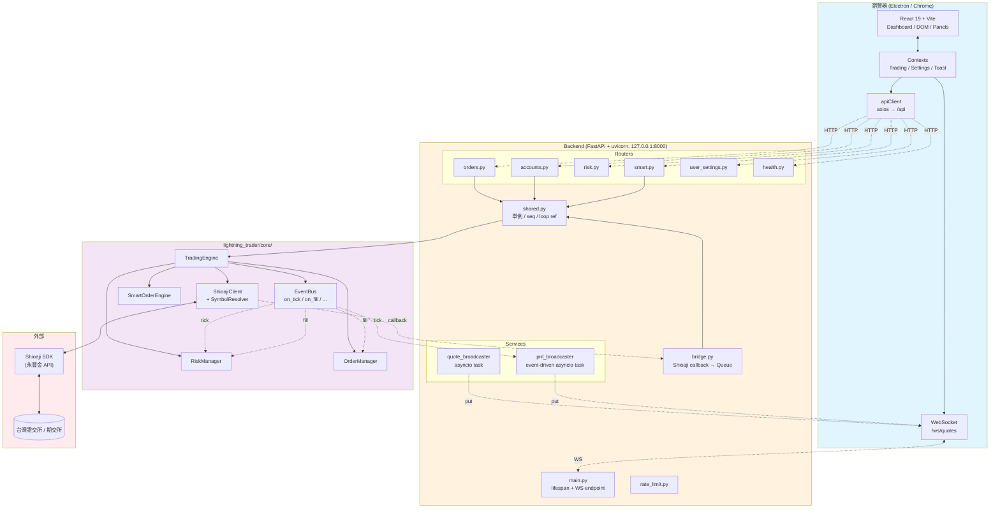

---

## 2. 啟動 Lifespan 序列

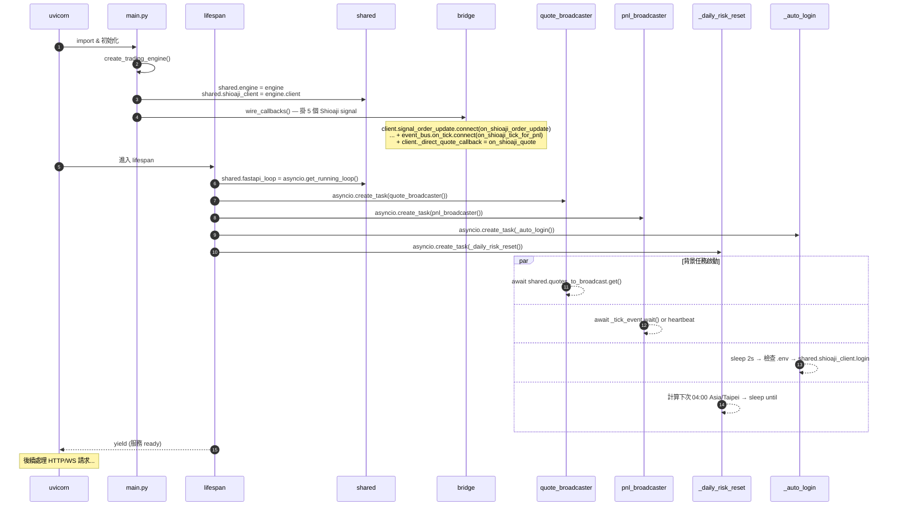

---

## 3. 登入流程（含 simulation 切換）

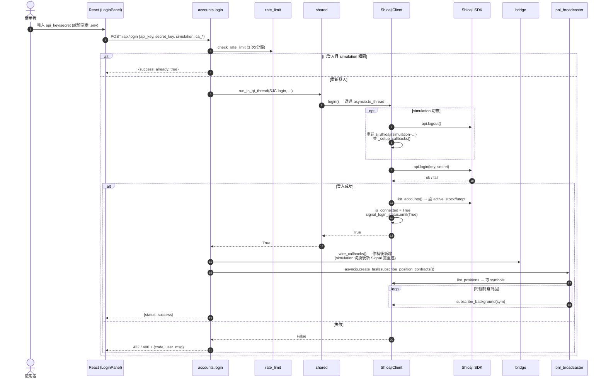

---

## 4. 下單流程（含 RiskManager + WARNING 確認）

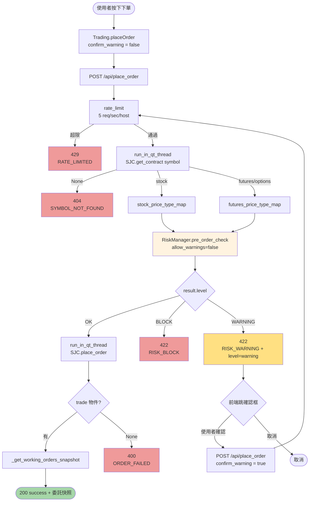

### RiskManager.pre_order_check 內部分支

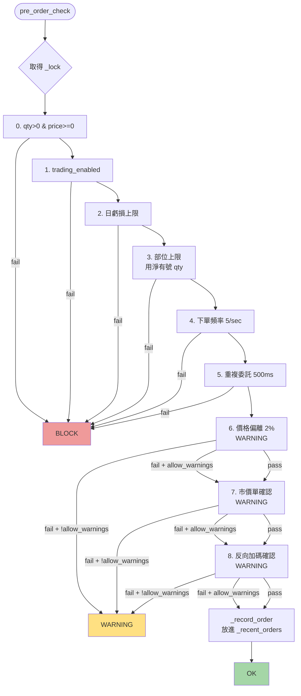

---

## 5. 即時報價流程（Shioaji → WebSocket）

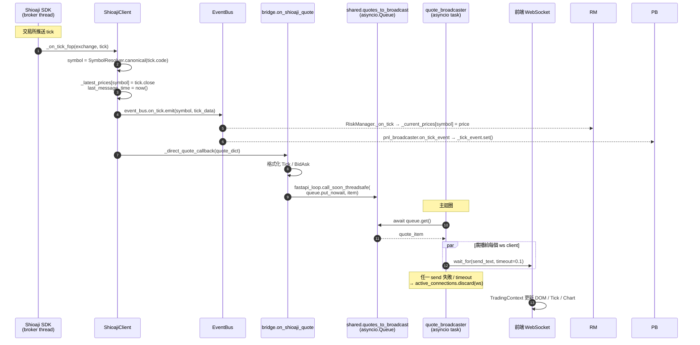

---

## 6. PnL 廣播流程（event-driven + debounce + heartbeat）

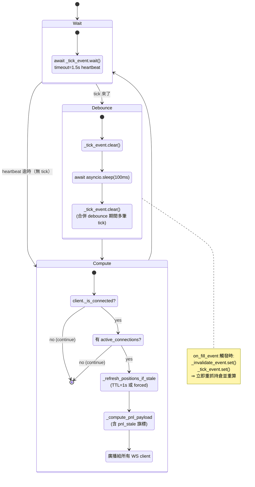

### PnL 計算（per position）

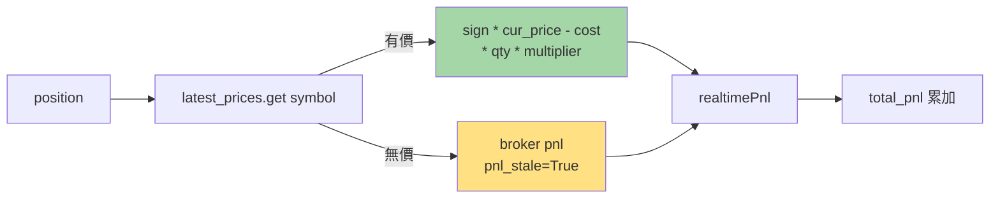

---

## 7. 訂單／成交回報流程

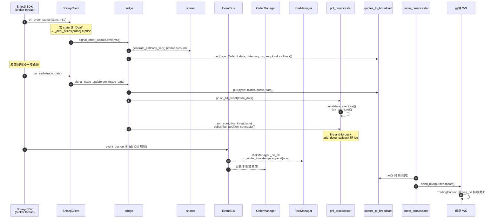

---

## 8. Watchdog + 自動重連

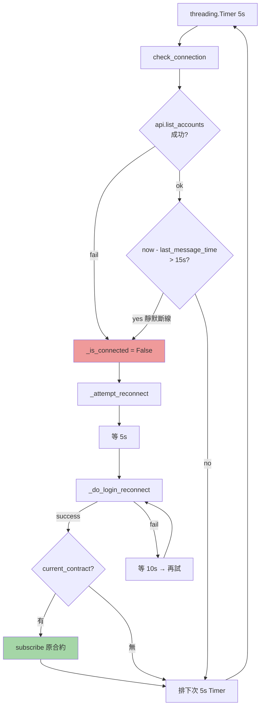

每次 Shioaji callback 都會更新 `last_message_time`；只要 15 秒內沒收任何 tick，watchdog 就視為靜默斷線並觸發重連。

---

## 9. 每日 04:00 風控重置

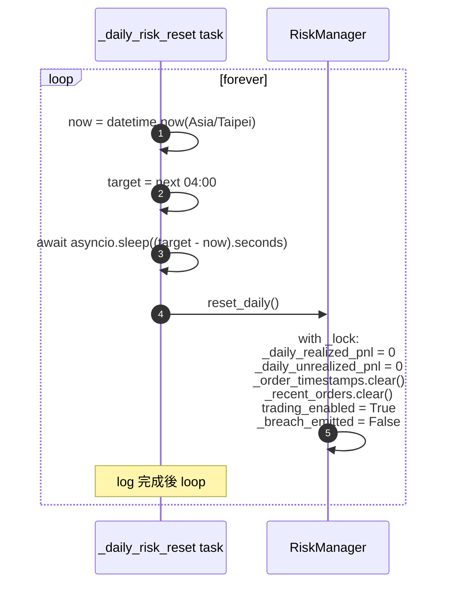

---

## 10. 執行緒 / 事件迴圈邊界

```mermaid
graph LR
    subgraph BrokerThread["Shioaji Broker Thread (同步)"]
        CB1[on_tick_fop / on_tick_stk]
        CB2[on_bidask_*]
        CB3[on_order_status]
        CB4[on_trade]
        Timer[threading.Timer 5s watchdog]
    end

    subgraph EventLoop["FastAPI asyncio Event Loop (主執行緒)"]
        WS[/ws/quotes handler/]
        QB[quote_broadcaster]
        PB[pnl_broadcaster]
        DL[_daily_risk_reset]
        AL[_auto_login]
        ROrd[orders.* handler]
        RAcc[accounts.* handler]
    end

    subgraph ThreadPool["asyncio default ThreadPoolExecutor"]
        TP1[SJC.login]
        TP2[SJC.place_order]
        TP3[SJC.list_positions]
        TP4[SJC.cancel_all]
        TP5[api.update_status]
    end

    CB1 & CB2 & CB3 & CB4 -.call_soon_threadsafe.-> EventLoop
    ROrd -.asyncio.to_thread.-> TP2 & TP3
    RAcc -.asyncio.to_thread.-> TP1 & TP3 & TP5
    PB -.asyncio.to_thread.-> TP3

    style BrokerThread fill:#ffebee
    style EventLoop fill:#e8f5e9
    style ThreadPool fill:#fff3e0
```

**核心安全性原則：**

| 邊界 | 跨越方式 | 註解 |
|---|---|---|
| Broker thread → Event loop | `shared.fastapi_loop.call_soon_threadsafe(queue.put_nowait, item)` | bridge 唯一允許的路徑 |
| Event loop → Shioaji sync API | `await shared.run_in_qt_thread(fn, ...)` = `asyncio.to_thread` | 修補後不再阻塞 event loop |
| Broker thread / Event loop 共讀 RiskManager state | `with self._lock:` | 修補後加 RLock |
| 訂單序號跨 thread | `itertools.count` (CPython 原子) | 修補後 thread-safe |

---

## 11. 前端 ↔ 後端訊息類型

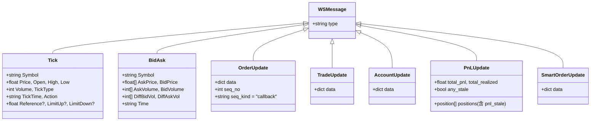

---

## 12. 部署拓樸（docker-compose）

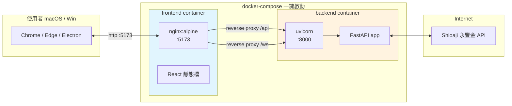

`docker-compose.yml` 跑兩個 container：

- **frontend**：nginx 靜態檔 + 反向代理 `/api`、`/ws` 到 backend
- **backend**：uvicorn + FastAPI，僅綁 container 內 8000 port，由 frontend 代理進來

CORS 設定（`main.py`）只允許 localhost；正式部署可透過 `LIGHTRADE_ALLOWED_ORIGINS` 環境變數擴充。
